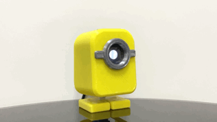

# obniz-chan
A JavaScript-driven obniz-embedded super-kawaii robot.

## Parts list
|  #  | Name |  Qty | URL  |
| ----| ---- | ---- | ---- |
|  1  |  obniz  |  1  |  https://akizukidenshi.com/catalog/g/gM-13685/  |
|  2  |  SG-90  |  2  |  https://akizukidenshi.com/catalog/g/gM-08761/  |
|  3  |PH-1X6RG |  1  |  https://akizukidenshi.com/catalog/g/gC-05336/  |
|  4  |3DP Filament |  1  |  https://snapmaker.jp/products/snapmaker-pla-yellow-500g  |
|  5  |Clear Cabochon |  1  |  https://www.amazon.co.jp/dp/B07X2M9V5G  |

## Reference
- This is a tribute piece to [Stack-chan](https://github.com/meganetaaan/stack-chan/blob/main/README_ja.md).

- Operation depends on [obniz](https://obniz.io/ja/).
