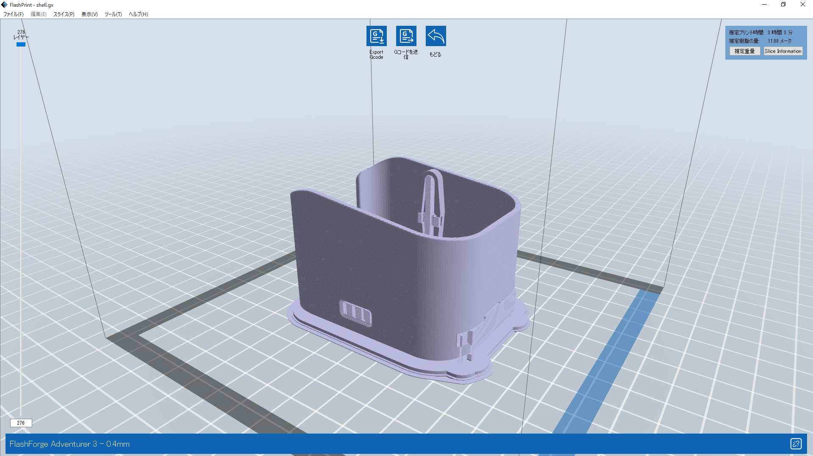
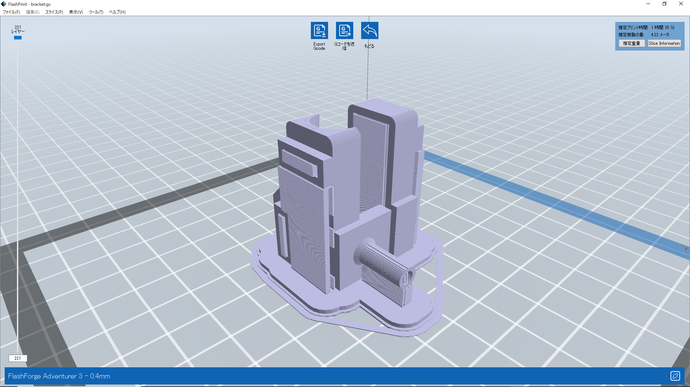
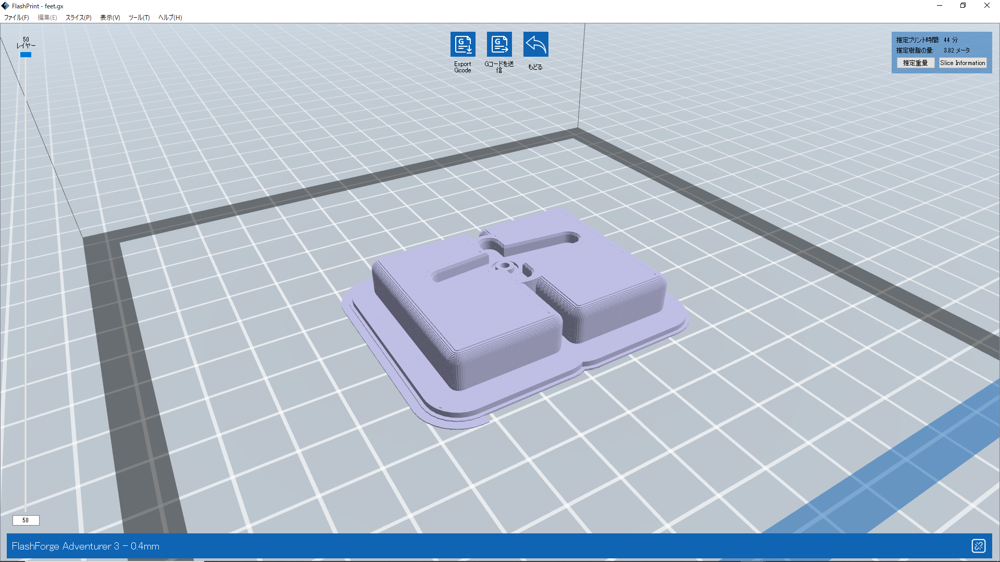
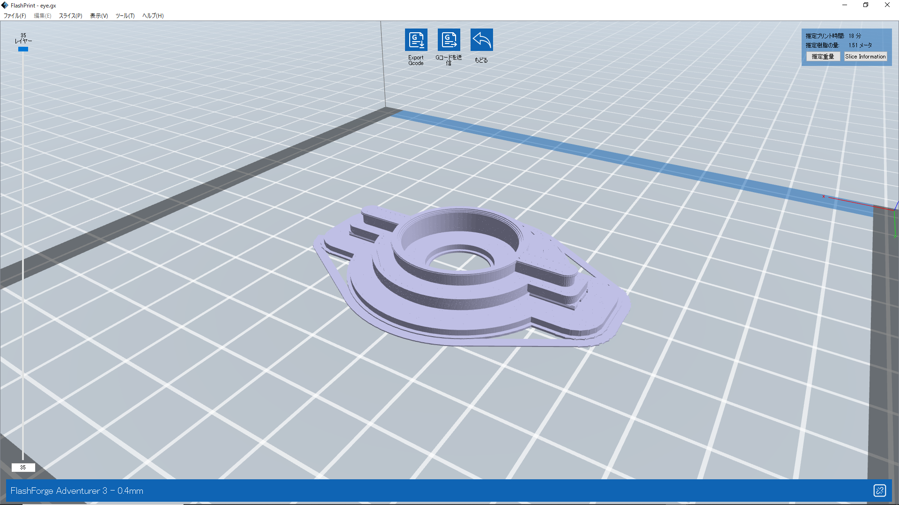

## Print Information
In case of FlashForge Adventurer3 -0.4mm, PLA

|  #  |  Name   |  Color   |  Time  |  Vol           |
| ----|  ----   |   ----   | ----   |  ----          |
|  1  |  shell  |  yellow  |  03:03 | 11.08m (33.03g)|
|  2  | bracket |  yellow  |  01:35 | 4.22m (12.60g) |
|  3  |   feet  |  yellow  |  00:44 | 3.82m (11.38g) |
|  4  |   eye   |  silver  |  00:18 | 1.51m (4.50g)  |

Possible for a total of 5:40 and 20.63m (61.50g)

